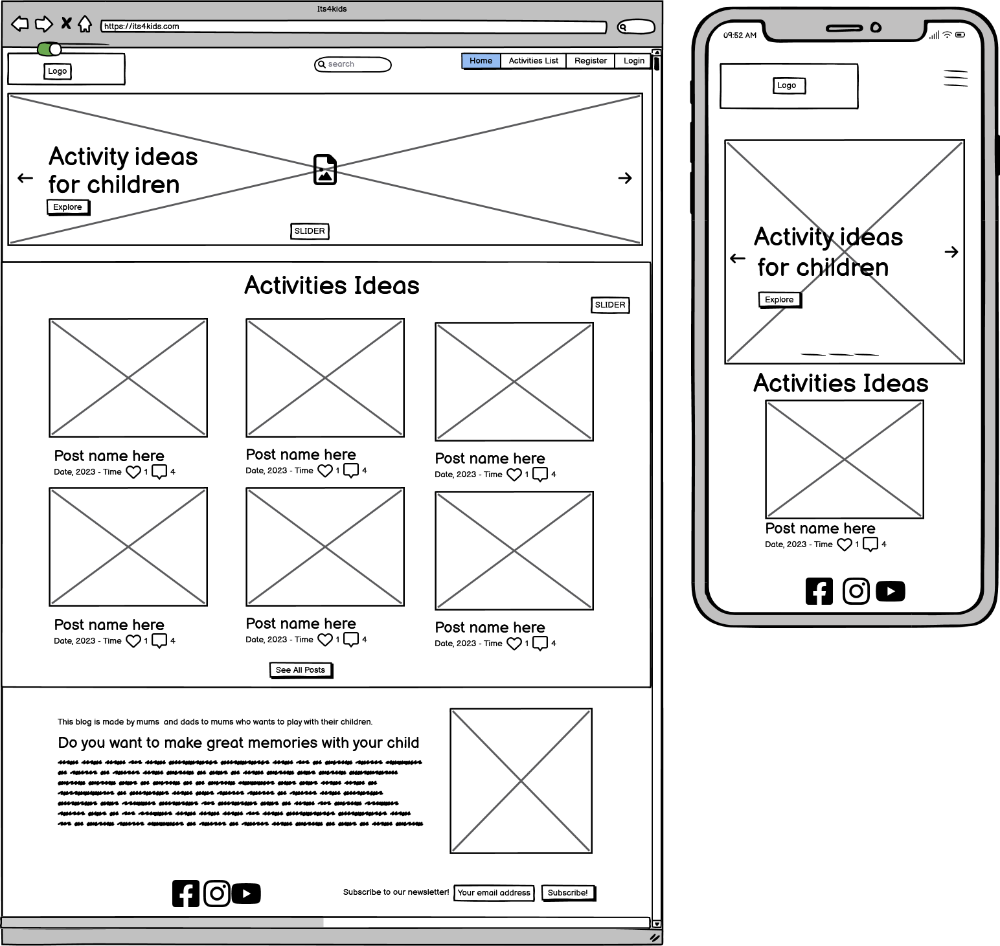
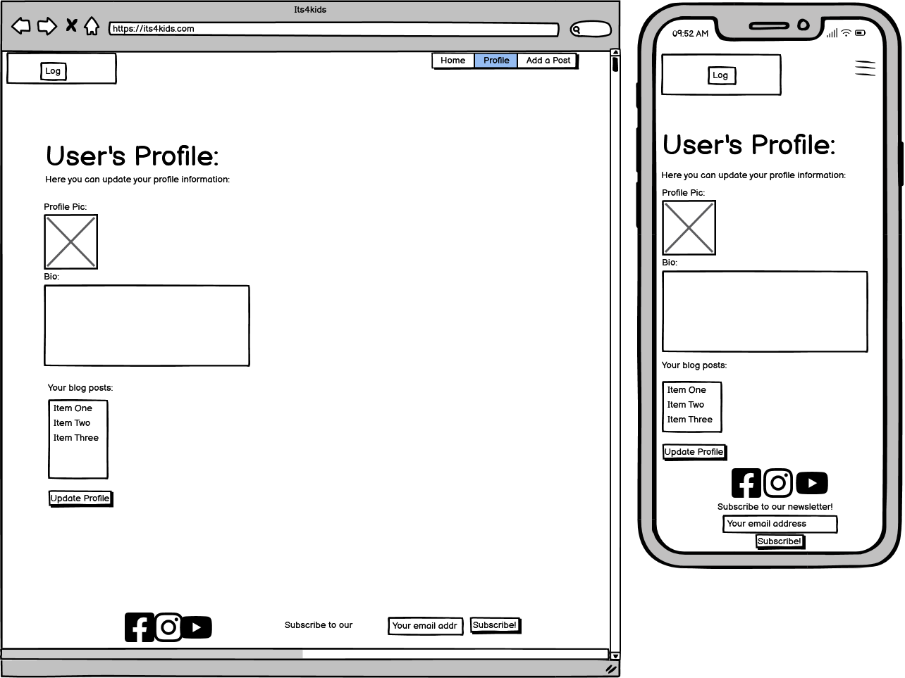

# **Its4kids - Project Portfolio 4**

Its4kids Blog is an online environment with an array of play ideas tailored to children of diverse ages. It is a place where parents and educators alike can find inspiration to connect with their children through play. Parents and educators can also contribute their own play ideas to the community.  Whether you are a parent looking to make lasting memories with your little ones or an educator seeking innovative approaches,  Its4kids blog is your ultimate destination. 

This is a fictional website that was created for Portfolio Project 4  - Diploma in Full Stack Software Development Diploma at the [Code Institute](https://www.codeinstitute.net).

Welcome to the live site here: <a href="https://its4kids.herokuapp.com/" target="_blank">Its4kids</a>

# Table of Content

* [**Project**](<#project>)
    * [Objective](<#objective>)
    * [Site Users Goal](<#site-users-goal>)
    * [Site Owners Goal](<#site-owners-goal>)
    * [Project Management](<#project-management>)
    * [Database Structure](<#database-structure>)
* [**User Experience (UX)**](<#user-experience-ux>)
    * [Target Audience](<#target-audience>)
    * [Wireframes](<#wireframes>)
    * [User Stories](<#user-stories>)
    * [Site Structure](<#site-structure>)
    * [Design Choices](<#design-choices>)
        *  [Typography](<#typography>)
        *  [Colour Scheme](<#colour-scheme>)
* [**Features**](<#features>)
    * [**Existing Features**](<#existing-features>)
        * [**Home**](<#home-page>)
        * [**Navigation bar**](<#navigation-bar>)
        * [**Play Ideas**](<#play-ideas-page>)
        * [**Add, Update and Delete Play Idea**](#crud-play-idea>)
        * [**Footer**](<#footer>)
        * [**User Profile**](<#user-page>)
        * [**Admin Page**](<#admin-page>)
    * [**Features left to implement**](<#future-features>)
* [**Technologies Used**](<#technologies-used>)
* [**Testing**](<#testing>)
* [**Deployment**](<#deployment>)
* [**Credits**](<#credits>)
    * [**Code**](<#code>)
*  [**Acknowledgements**](<#acknowledgements>)

# **Project**

## Objective

The objective of the "Its4kids Blog" project is to create a community-driven platform that aims to support parents in finding and sharing activity ideas to entertain and educate their children during their early childhood. As a mum of two small kids living in Ireland, a rainy country, I have personally experienced the challenges of coming up with engaging activities for my children. Therefore, the primary goal of this project is to provide a centralized space where parents can contribute and exchange activity ideas, fostering a sense of community and collaboration.

## Site Users Goal

The goal of a parent using Its4kids Blog is to discover engaging and age-appropriate activities for their children so that they can overcome the challenge of coming up with innovative ideas on their own. The goal is also to participate in a community-driven platform where they can can contribute by sharing activities and also expand their repertoire of activities and find inspiration for playtime with the kids.

## Site Owners Goal

The goal of the site owner is to create a centralized platform that brings together a wide range of children's activities, where parents can find inspiration and ideas for playing with their children. It also aims to provide a space where parents can contribute their own activity suggestions and engage with like-minded individuals.

[Back to top](<#table-of-content>)

## Project Management

## Agile 

Throughout the development of the Its4kids Blog project, I have adoped the **Agile approach** to ensure an organzied and efficient workflow. 
By adopting task management tools like Trello and GitHub Projects, I have successfully organized and tracked the progress of all the tasks that needed to be done. Trello was used for overall project planning, while GitHub Projects specifically helped in organizing the user stories.

To begin, I created a **Product Backlog** that encompassed all the tasks and features necessary for the project. This allowed me to have a clear overview of all tasks that needed to be accomplished. Then, I broke down the backlog into smaller and achievable units, which helped me to tackle each task effectively.

To ensure optimal productivity, I employed a **prioritization process** to assess the importance of each task in relation to the project goals. By assigning priorities, I could focus on the most critical tasks first, ensuring that valuable features were implemented promptly.

In addition to utilizing digital task management tools, I found it beneficial to maintain a physical notebook and pen to write down thoughts, ideas and any relevant information that surfaced during the development process. 

The Agile approach enabled me to maintain organization, time management, prioritize my work and reduce stress as I could switch tasks to refresh my mind when facing some problem. 

Follow below images of Trello and Github Board. 

<b>Trello & Github Board</b>

 

## Database Structure

The [Lucidchart](https://www.lucidchart.com/) tool was used to provide a clear representation of the database structure and relationships created, making it easier to understand and visualize the overall architecture of the blog.

Models used:

* **Post** - This model manages the play ideas featured in the blog.
* **Comment** - It allows users to provide their comments on the play ideas.
* **Category** -  Categories are used to classify and organize the blog posts.
* **UserProfile** - This model stores user profile information such as a bio and featured image.

<b>Database Structure</b>

 

[Back to top](<#table-of-content>)

# **User Experience (UX)**

## Target Audience

* Its4kids is a blog designed for parents and educators seeking inspiration and ideas for engaging activities to do and play with their children and students. 

## Wireframes 

The wireframes for Its4kids website were developed on [Balsamiq](https://balsamiq.com). They are of low fidelity as there have been modifications throughout the development of the blog. 

<b>Home</b>

<b>Post Detail</b>

 

<b>Add Post</b>

<b>Profile</b>

## User Stories

| Epic                  | Story                                                         | Task                                                                                      |
|-----------------------|---------------------------------------------------------------|-------------------------------------------------------------------------------------------|
| Admin Account management      | As a site user, I can create an account and/or login to my account so that I can access features for logged users.                   | - Set up a user authentication system (allauth).                                                     |
|                       |   As a site user, I can to access my profile so that I can create my bio, add a profile image, update it and also see the play ideas I have created.                                                           |      - Create a profile page (profile app)                                             |
|                       |                                                               |                                                                 |
|                       |                                                               |                                                                    

## Site Structure

Its4kids Blog is thoughtfully structured to cater to both registered and non-registered users, aiming to provide a great experience for all. For non-registered and logged-out users, the site offers access to key pages and sections such as "About," "Play ideas," and also "Subscribe to a newsletter" ensuring they can explore content relevant to their interests. Once users are registered and logged in, a broader range of features becomes available. In addition, they gain access to additional sections, being able to add a play idea, see their profile and also like posts and add comments.

## Design Choices

 * ### Logo

 The logo was designed on [Canva](https://www.canva.com/en_gb/) version Pro. A painted children hands icon was chosen to convey the core concept of children playing and also a community ethos. 

 

 * ### Typography
 
 The typography used throughout the site is Montserrat, as it is a nice font, elegant and, also conveys confidence and professionalism. It is very good for UX/UI for having good readability on any device, large x-heigh and, is also good for accessibility. 

 * ### Colour Scheme

Colour Palette image

## Features

### Existing Features

### Home 

<b>Home Page</b>

 

<b>Home Page Mobile</b>

 

### Navigation

<b>Navigation Large screen - User Logged out</b>

 

<b>Navigation Mobile - User Logged out</b>

 

### Play Ideas 

        * [**Play Ideas**](<#play-ideas-page>)
        * [**Add, Update and Delete Play Idea**](#crud-play-idea>)
        * [**Footer**](<#footer>)
        * [**User Profile**](<#user-page>)
        * [**Admin Page**](<#admin-page>)

### Home Page

### Navigation Bar

### Add, Update and Delete Play Idea

### Footer

### User Profile

### Admin Page

## Features left to implementation 

Its4kids Blog can be improved in the future through new features to be developed and implemented:

**Search functionality** - it’s very important to have a search functionality to allow users to search for activities based on keywords, categories, age group, or other criteria.

**Favorites play ideas** - Its very useful to allow users to ***favorite play ideas*** to show their appreciation and to easily access their favorite activities later on their profile page. 

**Sharing and Social Media Integration:** - Enable users to share play ideas on social media platforms such as Facebook, Instagram , Pinterest to reach a wider audience.

**Play Ideas Rating and Reviews** - for future development it would be nice to have a rating system where users can rate the play activities and leave reviews to provide feedback and help other users choose what to play with their children.

**Commenting functionality** - it’s very important to allow users to update and delete their comments. 

[Back to top](<#contents>)

## Technologies Used

### Languages

* [HTML 5](https://en.wikipedia.org/wiki/HTML/)
* [CSS 3](https://en.wikipedia.org/wiki/CSS)
* [JavaScript](https://www.javascript.com/)
* [Python](https://www.python.org/)

### Frameworks and supporting libraries other programs 

* [Django](https://www.djangoproject.com/) as the framework to build the blog.
* [Bootstrap](https://getbootstrap.com/) was used to style the website, easily add responsiveness and interactivity.
* [Gunicorn](https://gunicorn.org/) as the server for Heroku.
* [Cloudinary](https://cloudinary.com/) was used to host the static files and media.
* [Psycopg2](https://pypi.org/project/psycopg2/) was used for Python and PostgreSQL databases.
* [Summernote](https://summernote.org/) as a text editor.
* [Allauth](https://django-allauth.readthedocs.io/en/latest/installation.html) was used for authentication, registration, account management.
* [Crispy Forms](https://django-crispy-forms.readthedocs.io/en/latest/) to style the forms.
* [Gitbash](https://en.wikipedia.org/wiki/Bash_(Unix_shell)) to push changes to the GitHub repository.
* [GitHub](https://github.com/) to host the repositories.
* [Gitpod](https://www.gitpod.io/) as the IDE for the application.
* [Heroku](https://www.heroku.com/) to deploy the project.
* [PEP8](http://pep8online.com/) for testing and validating the code.
* [W3C CSS Validator](https://jigsaw.w3.org/css-validator/) - to validate the CSS.
* [W3C HTML Validator](https://validator.w3.org/) - to validate the HTML.
* [CANVA](https://www.canva.com/) to create the logo, color palete (Pro version) 

## Testing

### Code Validation

The Its4kids website has gone through intensive tests throughout its pages and sections/screens.The [W3C CSS Validator](https://jigsaw.w3.org/css-validator/) has been used to validate the CSS, [W3C HTML Validator](https://validator.w3.org/) has been used to validate the HTML, [JSHint](https://jshint.com/) to validate JavaScript and [PEP8](http://ww1.pep8online.com/) to validate Python. Additional tests, such as browser tests, manual testing, responsiveness test, testing user stories among others have been carried on as shown below. 

**HTML validation** 

[W3C HTML Validator](https://validator.w3.org/) has been used to validate the HTML. 

 

**CSS validation** 

[W3C CSS Validator](https://jigsaw.w3.org/css-validator/) has been used to validate the CSS. 

 

**JavaScript validation image**

 

**PEP8 validation image**

 

[Back to top](<#contents>)

### Browser Testing

Its4kids was manually tested on these browsers as table below and design, layout, functionality and, responsiveness were consistent across all browsers both mobile and desktop.

|   Browser   |    Result  | 
| :---------: | :---------:| 
| Chrome      |   pass     | 
| Edge        |   pass     |
| Firefox     |   pass     |
| Safari      |   pass     |
| IE          |   pass     | 

### Responsiveness Test

Its4kids website was manually tested for its responsiveness with [Google Chrome DevTools](https://developer.chrome.com/docs/devtools/) and [Responsive Design Checker](https://www.responsivedesignchecker.com/).

|        | Nexus 4/5/6 | Galaxy S5/S6/S7 | iPhone 6--12 | iPad |  Display <1200px | Display >1200px |
|--------|-------------|-----------------|--------------|------|------------------|-----------------|
| Render |    pass     |      pass       |     pass     | pass |     pass         |      pass       |
| Images |    pass     |      pass       |     pass     | pass |     pass         |      pass       |
| Links  |    pass     |      pass       |     pass     | pass |     pass         |      pass       |

### Manual Testing

Its4kids website has been extensively tested both on the Gitpod terminal and the Heroku deployed version on the browser. It has been checked features, responsiveness, accessibility, layout, design, texts, buttons and navigation links and form submission on different browsers. 
All tests made aimed to achieve the best user experience in system navigation, so that the user can follow an intuitive and easy flow at all system contact points.
Below are some examples of features tested manually.  

| Feature            |  Expect                           |  Result              |
| ------------------ | --------------------------------- | ---------------------|
| Run Task Tracker   |  Display welcome screen           |         Pass         | 
| New user press [1] |  Display welcome new user menu    |         Pass         |
| Returning user [2] |  Display returning user menu      |         Pass         |
|  Invalid inputs    |  Messages inputs not valid        |         Pass         |
|  Add new task      |  Requests inputs to be filled     |         Pass         | 
|  Store task sheets |  Add task on google shets         |         Pass         | 
|  Delete task       |  Requests task code to delete     |         Pass         | 
| Delete task sheets |  Delete task on google shets      |         Pass         |
|  Save task         |  Show saved tasks/Retrieve sheets |         Pass         |
|  Exit screen       |  Display end screen when typed [4]|         Pass         |

### Testing User Stories

| Expectation                         | Result                          |
| :---------------------------------: | :------------------------------:|
|  **[Quiz Website]** | |
|  **[Quiz Screen]**| |
|  **[Results Screen]**| |
| **[Contact Screen]**|  |
| **[Form Destination Page]** | |

[Back to top](<#contents>)

### Bugs Fixed

 

### Bugs Unfixed

### Additional Testing

### Acessibility 

To check the accessibility in color regarding was used the [A11y](https://color.a11y.com/).

 

### Lighthouse

A test on [Google Lighthouse](https://developers.google.com/web/tools/lighthouse) was also done through  Chrome Developer Tools.

It tests each of the pages for ***performance, accessibility, best practices and, SEO***

[Back to top](<#contents>)

## Deployment

### Initial Deployment

The deployment process was done mainly following the steps provided by the Code Institute through the walkthrough **I think therefore I blog** and the [Django Blog Cheat Sheet](https://docs.google.com/document/d/1P5CWvS5cYalkQOLeQiijpSViDPogtKM7ZGyqK-yehhQ/edit#heading=h.5s9novsydyp1):

1. A new repository called its4kids-blog was created on [GitHub](https://github.com/) using the [Code Institute full template](https://github.com/Code-Institute-Org/gitpod-full-template).
2. A new workspace was created in Gitpod by clicking to the green ‘Gitpod’ button.
3. Django and supporting libraries were installed.
4. An external database was created on [ElephantSQL](elephantsql.com) 
5. An app was created deployed to [Heroku](heroku.com).
6. The static and media files were stored on [Cloudinary](Cloudinary.com.)

### Final Deployment 

The final deployment was conducted following the steps below:

1. The **settings.py** file was changed as below and the changes were commited:

DEBUG = False

X_FRAME_OPTIONS = 'SAMEORIGIN' 

2. In **Heroku** website I revealed the config vars and deleted as below:

DISABLE_COLLECTSTATIC = 1

3. Then I deployed the branch and opened the website app which was deployed successfully. 

### **Forking this repository on GitHub**

A fork of this repository can be made which will allow you to make changes to this project without affecting the original repository. 

The steps below should be followed to ***fork*** the respository:

1. Log in to ***GitHub*** and find the [repository](https://github.com/fmstacco/its4kids-blog).

2. Click on the button ***fork*** on the right-hand side of the page to create a copy of the original repository in your GitHub account.

See the image below:

[Back to top](<#contents>)

### **Cloning this project on GitHub**

The steps below should be followed to ***clone*** the respository:

1. On the repository’s page, click on the ***code*** tab.
2. On the ***Clone with HTTPS*** tab, click on the icon (see image below) to copy the URL.

3. Open ***Git Bash*** on your IDE terminal.
4. Change the current working directory to the location where you want the cloned directory.
5. Type ***git clone***, and then paste the URL copied from GitHub.

Type: git clone + https://github.com/fmstacco/its4kids-blog.git

6. Press ***enter*** and the local clone will be created.

Help on cloning a repository from GitHub can be found [here](https://docs.github.com/en/repositories/creating-and-managing-repositories/cloning-a-repository).

[Back to top](<#contents>)

# Credits

* [I Think therefore I Blog](https://learn.codeinstitute.net/courses/course-v1:CodeInstitute+FST101+2021_T1/courseware/b31493372e764469823578613d11036b/fe4299adcd6743328183aab4e7ec5d13/) - this project was created based on the walkthrough I think therefore I Blog.
* [Tasty Blog](https://github.com/PedroCristo/portfolio_project_4) - this project inspired me and I borrow some of the code for the hero section carousel.
* [Location Blog](https://github.com/DionneMaguire/locationblog), [Best Beers](https://github.com/vivignutz/berlin_bestbeers/) and [Review | Alliance](https://github.com/worldofmarcus/project-portfolio-4) - these projects were also source of inspiration to my develop my blog and structure my README.
* [Unplash](https://unsplash.com/) - I got pictures for hero carousel and the blog posts.
* [Canva](https://canva.com/) - I used Canva Pro to design the logo, color palete, and also images for the website, such as about section, blog posts, default profile image, etc. 
* [CODEMY.COM YOUTUBE](https://www.youtube.com/playlist?list=PLCC34OHNcOtr025c1kHSPrnP18YPB-NFi) - Create a Simple Django Blog. I got the inspiration from this tutorial and playlist to code many functionalities of the blog, such as add a blog post, profile page, category, add blog user name to navbar, among others.  
* [Good Housekeeping](https://www.goodhousekeeping.com/life/parenting/g31445865/indoor-activities-for-kids/) - content for the blog posts.

# Acknowledgements

Its4kids was designed and developed for Portfolio 4 project, a requirement of Full Stack Software Developer Diploma Course (Eccommerce) at the [Code Institute](https://codeinstitute.net/). Firstly I would like express my gratitude to Bethany from the Student Care, without her huge support, encouragement and understanding I would not be able to complete this project. I also would like to thank my mentor [Precious Ijege](https://www.linkedin.com/in/precious-ijege-908a00168/), my Cohort facilitators, my Cohort colleagues, the Slack community and the Tutor Assistance for all guidance and support during this journey. I am also thankful to the ***Mayo, Sligo and Leitrim Education Training Board (msletb)*** for this opportunity. I  would also like to say thank you to my family, my husband Michel and, my children, Alanna, and Peter who is just 16 months old at the time of this project submission. 

Fabiana Tacco (2023)

[Back to top](<#contents>)
