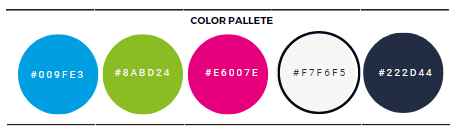

# **Its4kids - Project Portfolio 4**

Its4kids is an environment to get and share play ideas for children by people interested in contributing to a more playing world, such as parents, educators, as well as future education professionals... 

Welcome to the live site here: <a href="https://its4kids.herokuapp.com/" target="_blank">Its4kids</a>

# Contents

* [**Objective**](<#objective>)
* [**User Experience UX**](<#user-experience-ux>)
    * [Target Audience](<#target-audience>)
     [Wireframes](<#wireframes>)
    * [Site Structure](<#site-structure>)
    * [Design Choices](<#design-choices>)
        *  [Typography](<#typography>)
        *  [Colour Scheme](<#colour-scheme>)
* [**Data Model**](<#data-model>)
* [**Features**](<#features>)
    * [**Existing Features**](<#existing-features>)
    * [**Home**](<#home-page>)
        * [Navigation bar](<#navigation-bar>)
        * [Gallery Carousel](<#gallery-carousel>)
        * [About-us](<#about-us>)
        * [Footer](<#footer>)
        * [**Browse Ideas**](<#browse-page>)
        * [**User Profile**](<#user-page>)
        * [**Contact**](<#contact-page>)
            * [Contact details](<#contact-details>)
            * [Contact Form](<#contact-form>)
            * [Testimonials](<#testimonials>)
            * [Location Map](<#location-map>)
        * [**Admin Page**](<#admin-page>)
        * [**Future Features**](<#future-features>)
* [**Technologies Used**](<#technologies-used>)
* [**Testing**](<#testing>)
* [**Deployment**](<#deployment>)
* [**Credits**](<#credits>)
    * [**Code**](<#code>)
*  [**Acknowledgements**](<#acknowledgements>)

## User Stories

## Design Choices

 * ### Logo

 The logo was designed on [Canva](https://www.canva.com/en_gb/) version Pro. A painted children hands icon was chosen to convey the core concept of children playing and also a community ethos. 

 

 * ### Typography
 
 The typography used throughout the site is Montserrat, as it is a nice font, elegant and, also conveys confidence and professionalism. It is very good for UX/UI for having good readability on any device, large x-heigh and, is also good for accessibility. 

 * ### Colour Scheme

Colour Palette image

### Data Model

#### Post Model

| Key | Name | Type
|-----|----------------|------------------|
| foreign key | author | User Model
| | title (unique) | Char[200]
| | created_date | DateTime
| | updated_date | DateTime
| | content | TextField
| | featured_image | Cloudinary_image
| | excerpt | TextField
| many-to-many | likes | User Model
| label for url | slug (unique) | SlugField
| | status | Integer

#### Comment model

#### Profile model

## Technologies Used

### Languages

* [HTML 5](https://en.wikipedia.org/wiki/HTML/)
* [CSS 3](https://en.wikipedia.org/wiki/CSS)
* [JavaScript](https://www.javascript.com/)
* [Python](https://www.python.org/)

### Frameworks and supporting libraries other programs 

* [Django](https://www.djangoproject.com/) as the framework to build the blog.
* [Bootstrap](https://getbootstrap.com/) was used to style the website, easily add responsiveness and interactivity.
* [Gunicorn](https://gunicorn.org/) as the server for Heroku.
* [Cloudinary](https://cloudinary.com/) was used to host the static files and media.
* [Psycopg2](https://pypi.org/project/psycopg2/) was used for Python and PostgreSQL databases.
* [Summernote](https://summernote.org/) as a text editor.
* [Allauth](https://django-allauth.readthedocs.io/en/latest/installation.html) was used for authentication, registration, account management.
* [Crispy Forms](https://django-crispy-forms.readthedocs.io/en/latest/) to style the forms.
* [Gitbash](https://en.wikipedia.org/wiki/Bash_(Unix_shell)) to push changes to the GitHub repository.
* [GitHub](https://github.com/) to host the repositories.
* [Gitpod](https://www.gitpod.io/) as the IDE for the application.
* [Heroku](https://www.heroku.com/) to deploy the project.
* [PEP8](http://pep8online.com/) for testing and validating the code.
* [W3C CSS Validator](https://jigsaw.w3.org/css-validator/) - to validate the CSS.
* [W3C HTML Validator](https://validator.w3.org/) - to validate the HTML.
* [CANVA](https://www.canva.com/) to create the logo, color palete (Pro version) 

## Deployment

### Initial Deployment

#### Github, Django, and Heroku

1. A new repository called Its4kids was created on [GitHub](https://github.com/) using the [Code Institute full template](https://github.com/Code-Institute-Org/gitpod-full-template).
2. A new workspace was created in Gitpod by clicking to the green ‘Gitpod’ button.

### Final Deployment 

The final deployment was conducted following the steps below:

1. The *settings.py* file was changed as below and the changes were commited:

DEBUG = False

X_FRAME_OPTIONS = 'SAMEORIGIN' 

2. In *Heroku* website I revealed the config vars and deleted as below:

DISABLE_COLLECTSTATIC = 1

3. Then I deployed the branch and opened the website app which was deployed successfully. 

### **Forking this repository on GitHub**

A fork of this repository can be made which will allow you to make changes to this project without affecting the original repository. 

The steps below should be followed to ***fork*** the respository:

1. Log in to ***GitHub*** and find the [repository](https://github.com/fmstacco/its4kids-blog).

2. Click on the button ***fork*** on the right-hand side of the page to create a copy of the original repository in your GitHub account.

See the image below:

[Back to top](<#contents>)

### **Cloning this project on GitHub**

The steps below should be followed to ***clone*** the respository:

1. On the repository’s page, click on the ***code*** tab.
2. On the ***Clone with HTTPS*** tab, click on the icon (see image below) to copy the URL.

3. Open ***Git Bash*** on your IDE terminal.
4. Change the current working directory to the location where you want the cloned directory.
5. Type ***git clone***, and then paste the URL copied from GitHub.

Type: git clone + https://github.com/fmstacco/its4kids-blog.git

6. Press ***enter*** and the local clone will be created.

Help on cloning a repository from GitHub can be found [here](https://docs.github.com/en/repositories/creating-and-managing-repositories/cloning-a-repository).

[Back to top](<#contents>)

# Credits

* [I Think therefore I Blog](https://learn.codeinstitute.net/courses/course-v1:CodeInstitute+FST101+2021_T1/courseware/b31493372e764469823578613d11036b/fe4299adcd6743328183aab4e7ec5d13/) - this project was created based on the walkthrough I think therefore I Blog.
* [Tasty Blog](https://github.com/PedroCristo/portfolio_project_4) - this project inspired me and I borrow some of the code for the hero section carousel.
* [Location Blog](https://github.com/DionneMaguire/locationblog) - this project also inspired me.
* [Unplash](https://unsplash.com/) - I got pictures for hero carousel and the blog posts.

# Acknowledgements

Its4kids was designed and developed for Portfolio 4 project, a requirement of Full Stack Software Developer Diploma Course (Eccommerce) at the [Code Institute](https://codeinstitute.net/). I would like to thank my mentor [Precious Ijege](https://www.linkedin.com/in/precious-ijege-908a00168/), my Cohort facilitators, my Cohort colleagues, the Slack community, the Tutor Support and a big thanks to Bethany from the Student care for all support during this journey. I am also thankful to the ***Mayo, Sligo and Leitrim Education Training Board (msletb)*** for this opportunity. I  would also like to say thank you to my family, my husband Michel and, my children, Alanna, and Peter who is just 11 months old at the time of this project submission. 

Fabiana Tacco (2023)

[Back to top](<#contents>)
